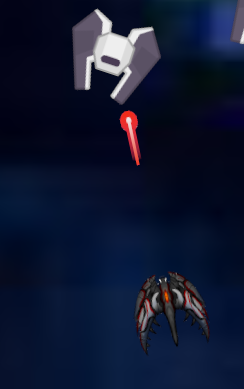

# VampireSurvivor

## Description

This project was made in one week during the "Innovation Week" at Epitech and is a 2D game where you play as a ship that has to survive against waves of enemies. The game is made in Rust using the Bevy engine.

## Objective

The goal of this week was to learn a new language and a new engine. We choose Rust and Bevy because we wanted to learn them and because they are very powerful to make games.

## Installation

```bash
cargo run
```

## Usage

You can move the ship with the arrow keys and shoot with the space key.

